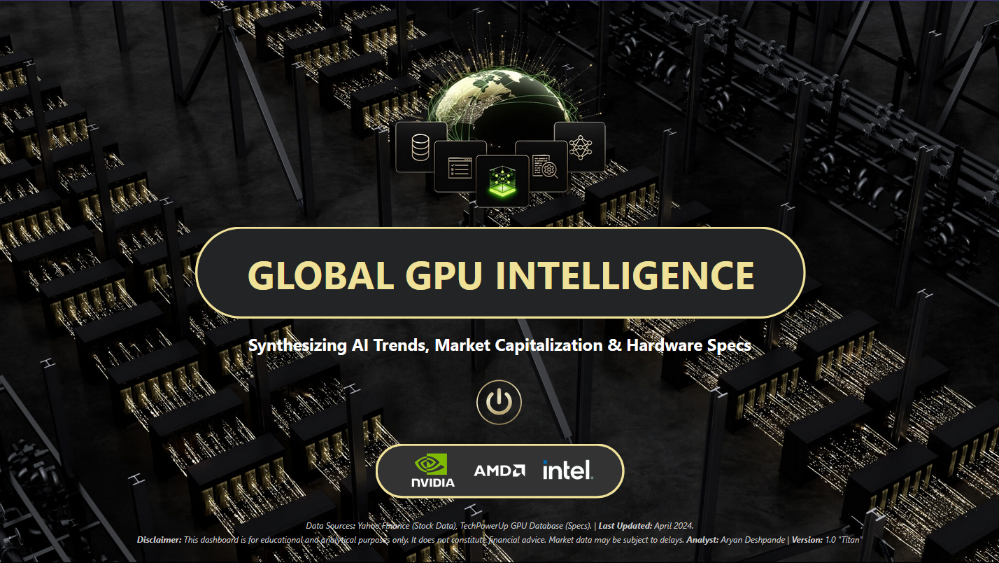
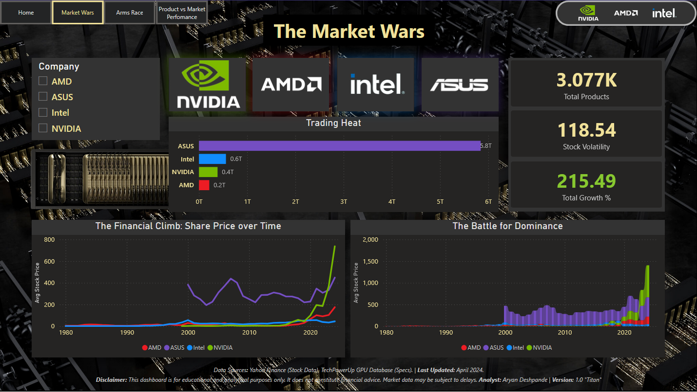
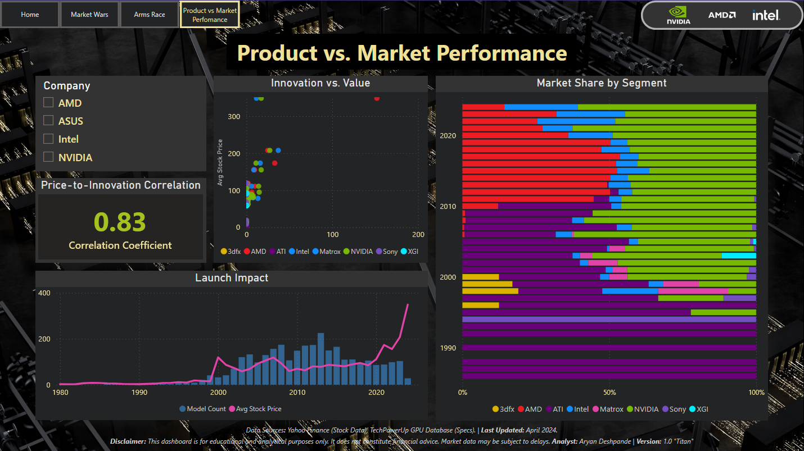
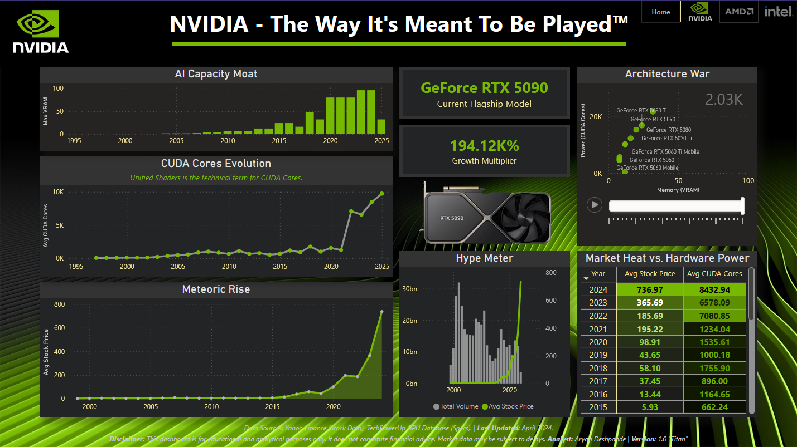

<p align="center">
  
</p>

# 🚀 Project Silicon: The GPU Trinity
### Global GPU Intelligence Dashboard (Power BI)

> Synthesizing AI Trends, Market Capitalization & Hardware Evolution  
> A strategic comparative analytics project on NVIDIA, AMD, and Intel.

## 📌 Project Overview
**Project Silicon** is an advanced Power BI dashboard analyzing the competitive dynamics between the three dominant GPU manufacturers:
- 🟢 NVIDIA  
- 🔴 AMD  
- 🔵 Intel  

The project integrates:
- Historical stock performance  
- GPU architecture evolution  
- VRAM and shader progression  
- AI hardware growth trends  
- Innovation vs. valuation correlation  

The goal is to uncover how **hardware innovation translates into market dominance and financial acceleration** in the AI era.

## 📷 Dashboard Preview

### 🏠 Home


### ⚔️ Market Wars


### 🧠 Arms Race


### 📈 Product vs Market Performance


### 🏢 NVIDIA Page (Same kind of pages exist in the project for AMD and Intel)


## 🎯 Problem Statement
The GPU industry powers:
- Artificial Intelligence  
- High-Performance Computing  
- Gaming  
- Cloud Infrastructure  

This project answers:
- Does innovation correlate with stock performance?
- Who leads the GPU arms race?
- How do product cycles impact valuation?
- Is AI demand reshaping financial dominance?

The dashboard uses structured data modeling and interactive analytics to deliver strategic insights.

## 📊 Dashboard Structure

### 🏠 Home – Industry Overview  
Executive summary of market positioning and competitive landscape.

### ⚔️ Market Wars  
- Stock price evolution  
- Growth multipliers  
- Volatility comparison  
- Market performance trends  

### 🧠 The Arms Race  
- VRAM growth trends  
- Shader/core evolution  
- Clock speed progression  
- Product advancement timeline  

### 📈 Innovation vs Market Performance  
- Correlation (Price vs VRAM)  
- Growth comparison  
- Product impact on stock movement  

### 🏢 Company Deep Dives  
Dedicated strategic analysis for:
- NVIDIA  
- AMD  
- Intel  

## 🛠 Tools & Technologies
- Power BI Desktop  
- Power Query (ETL)  
- DAX (Advanced Measures & Statistical Modeling)  
- Star Schema Data Modeling  
- Financial & Technical Dataset Integration  

## 🧩 Data Modeling Approach

**Fact Tables**
- Stock Performance  
- Product Specifications  
- Launch Timeline  
- Market Share  

**Dimension Tables**
- Company  
- Calendar  
- Product Category  
- GPU Architecture  

Model optimized for:
- Cross-filtering  
- Drill-down analytics  
- Dynamic company comparison  

## 📂 Data Sources

### 🖥 GPU Specifications  
Graphics Card Full Specs Dataset  
Source: Kaggle  
https://www.kaggle.com/datasets/alanjo/graphics-card-full-specs  

### 📈 Stock Market Data  
NVIDIA, AMD, Intel Share Prices Dataset  
Source: Kaggle  
https://www.kaggle.com/datasets/kapturovalexander/nvidia-amd-intel-asus-msi-share-prices  

> ⚠️ Raw datasets are not redistributed in this repository due to Kaggle licensing restrictions.  
> Please download directly from the official dataset links above.

## 📈 Key Insights
- NVIDIA shows strong AI-driven acceleration post-2016.  
- AMD demonstrates aggressive VRAM scaling and competitive positioning.  
- Intel is rebuilding GPU presence through Arc architecture.  
- Innovation intensity shows a strong positive correlation with stock growth.  
- AI demand cycles significantly influence financial volatility.  

## 💡 Business Value
This dashboard supports:
- Investment evaluation in AI hardware markets  
- Competitive benchmarking of GPU manufacturers  
- Product strategy analysis  
- Financial-technical correlation studies  

## 📁 Repository Structure
- Assets contain Dashboard Visuals, Complete Walkthrough PDF and Repository Banner / Social Media Preview Image.
- Datasets contain Dataset References (no raw data included)
- Scripts contain DAX Documentation
- *Project Silicon - The GPU Trinity.pbix* is the Complete Interactive Power BI Dashboard

```text
Project-Silicon-The-GPU-Trinity/
│
├── Assets/
│   ├── 1-Home.png
│   ├── 2-Market-Wars.png
│   ├── 3-Arms-Race.png
│   ├── 4-Product-vs-Market-Performance.png
│   ├── 5.1-NVIDIA-Page.png
│   ├── 5.2-AMD-Page.png
│   ├── 5.3-Intel-Page.png
│   ├── 6-Project-Silicon-The GPU-Trinity-Complete-Walkthrough.pdf
│   ├── 7.1-Project-Silicon-The GPU-Trinity-Banner.png
│   └── 7.2-Project-Silicon-The GPU-Trinity-Social-Preview.png
│
├── Datasets/
│   └── Data-Sources.md
│
├── Scripts/
│   └── DAX-Measures.md
│
├── Project Silicon - The GPU Trinity.pbix
│
└── README.md
```

## 👤 Author
**Aryan Deshpande**  
> Aspiring Data Analyst
